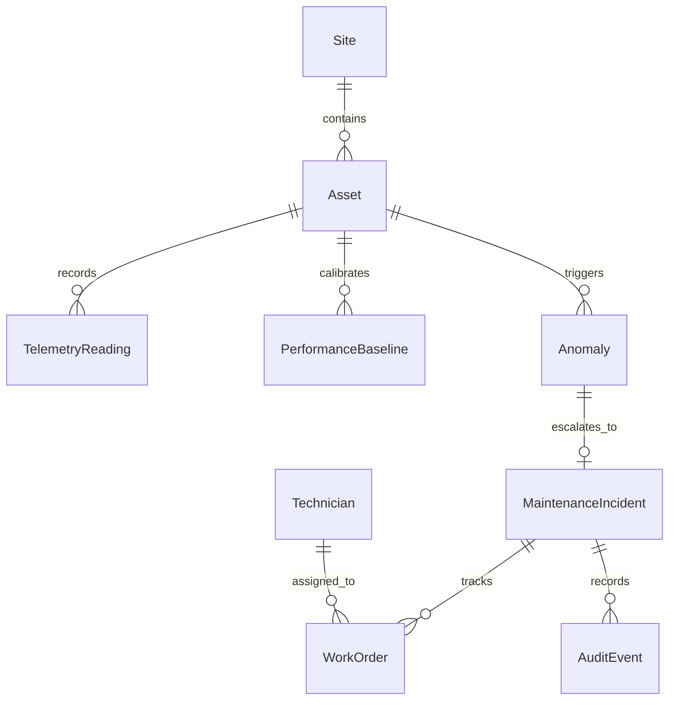

# ☀️ Solatrace: Renewable Energy Asset Performance & Operations Platform

> **An operational telemetry, anomaly detection, and maintenance verification platform for solar arrays, inverters, and battery energy storage systems (BESS).**

[](https://opensource.org/licenses/MIT)
[](https://www.oracle.com/java/)
[](https://spring.io/projects/spring-boot)
[](https://www.python.org/)
[](https://fastapi.tiangolo.com/)
[](https://react.dev/)

---

## 1. System Overview
Solatrace bridges the gap between raw timeseries telemetry and actionable site operations. When renewable generation deviates from expected physical baselines, Solatrace:
1. Filters out momentary noise and detects **sustained underperformance**.
2. Automatically generates **Maintenance Incidents** ranked by estimated revenue/power loss, asset criticality, and duration.
3. Dispatches and tracks **Work Orders** assigned to field technicians.
4. Enforces a **Closed-Loop Post-Repair Verification Window** that continuously monitors post-intervention telemetry before auto-closing the incident.

---

## 2. Architecture & Data Flow

```mermaid
flowchart TD
    subgraph Edge & Simulation
        SIM[Synthetic Telemetry Simulator] -->|5-min Batch / Live Stream| ING[Telemetry Ingestion Controller]
    end

    subgraph Backend Core (Spring Boot 3 / Java 21)
        ING --> S_ING[Telemetry Processing Service]
        S_ING --> DB[(PostgreSQL Timeseries DB)]
        S_ING --> REDIS[(Redis Cache / State)]
        S_ING -->|REST / Async Payload| PY_ANA[FastAPI Analytics Engine]
        
        PY_ANA -->|Anomaly Scores & Root-Cause| S_ANO[Anomaly & Incident Engine]
        S_ANO -->|Rank & Create P1-P4| INC[Maintenance Incident Manager]
        INC --> WO[Work Order & Technician Dispatch]
        
        VERIF[Scheduled Verification Engine] -->|Post-Repair Evaluation| INC
        
        INC --> WS[WebSocket STOMP Broker]
    end

    subgraph Frontend Dashboard (React + TS + Tailwind + Recharts)
        WS -->|Live Telemetry & Alerts| UI[Operations Console]
        UI -->|REST Operations| S_ING
    end
```

---

## 3. Domain Entity Relationship Diagram



---

## 4. Key Business Logic

### A. Anomaly Detection Thresholds
- **Sustained Deviation**: A drop $\ge 15\%$ below expected output lasting for $\ge 3$ consecutive 5-minute sampling windows (15 minutes).
- **Physical Temperature Derating**: Accounts for module temperature coefficient ($\beta \approx -0.38\% / ^\circ\text{C}$ above $25^\circ\text{C}$) to prevent false alarms during hot sunny days.

### B. Dynamic Incident Priority Scoring
$$\text{Priority Score} = (\text{Estimated Loss (kW)} \times 0.40) + (\text{Duration (hours)} \times 0.20) + (\text{Asset Criticality [1-5]} \times 0.25) + (\text{Urgency Factor} \times 0.15)$$

- **P1 - Critical**: Score $\ge 75$ or Loss $> 100\text{ kW}$ on central inverter.
- **P2 - High**: Score $\ge 50$.
- **P3 - Medium**: Score $\ge 25$.
- **P4 - Low**: Score $< 25$.

### C. Post-Repair Verification Loop
When a technician marks a work order as `WORK_COMPLETED`, the incident transitions to `PENDING_VERIFICATION`. A 60-minute window evaluates new incoming telemetry. If actual output achieves $\ge 95\%$ of the physical baseline, the incident auto-closes with a verified audit badge. Otherwise, it is flagged for re-inspection.

---

## 5. Quick Start (Local Setup)

### Prerequisites
- Docker & Docker Compose
- Java 21 JDK + Maven (optional for containerized run)
- Python 3.11+ (optional for containerized run)
- Node.js 18+ (optional for containerized run)

### Launch Complete Stack with Docker Compose
```bash
docker-compose up --build -d
```

- **Frontend Dashboard**: http://localhost:3000
- **Spring Boot API & Swagger**: http://localhost:8080/swagger-ui.html
- **FastAPI Analytics API Docs**: http://localhost:8000/docs
- **PostgreSQL**: `localhost:5432` (`solatrace_db` / `solatrace_user`)
- **Redis**: `localhost:6379`
